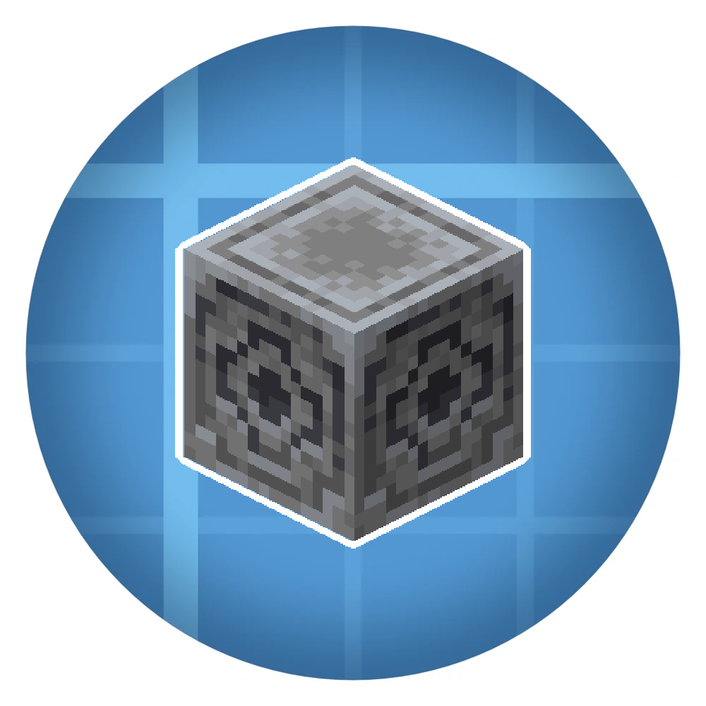
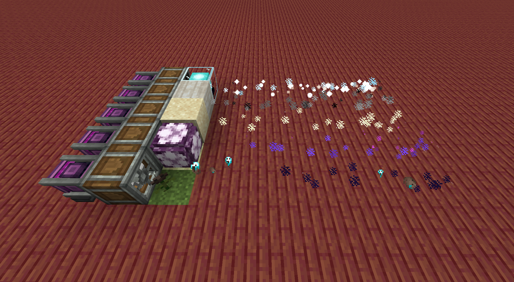
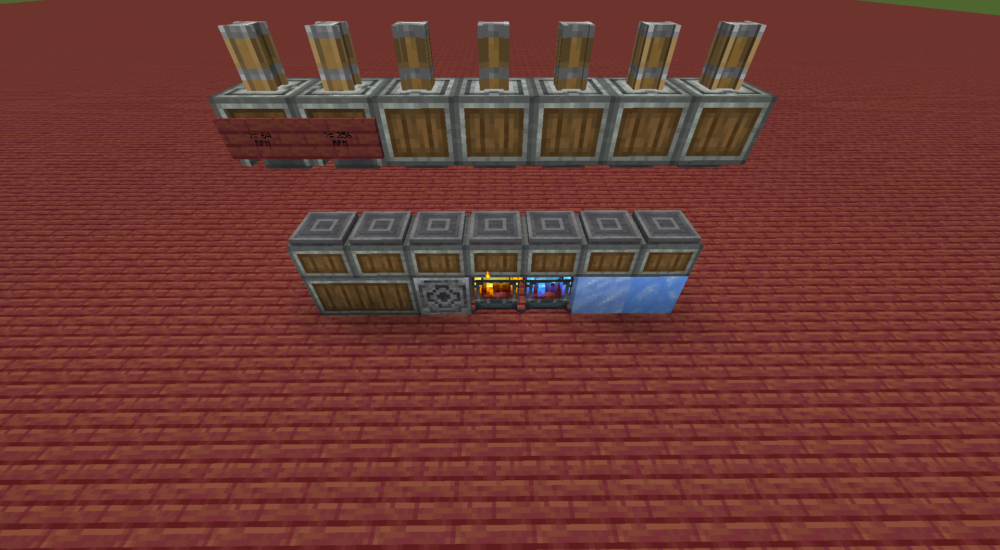
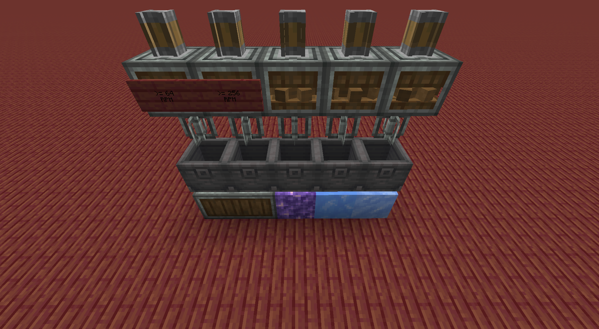

<h1 align="center">Creation Processes</h1>

  

Creation-based addon for NeoForge 1.21.1 which contains new process types.

<h2 align="center">Downloads</h2>

  
  

<h2 align="center">Features</h2>

<h3 align="center">Ways to Process with a Fan</h3>

  Withering processes 
  Purifying processes 
  Sanding processes 
  Petrifying processes 
  Enderfying processes

<h3 align="center">Pressing and Mixing</h3>

  Hot Pressing 
  Cold Pressing 
  Magnetic Pressing 
  Speed Pressing 
  Cold Mixing 
  Resonance Mixing 
  Speed Mixing

<h3 align="center">Ways to Process Using a Fan</h3>

  

<h3 align="center">Ways to Process Using a Press</h3>

  

<h3 align="center">Ways to Process Using a Mixer</h3>

  

<h2 align="center">How it Works</h2>

  The majority of this add-on is based upon existing machines and recipes from Create. 
  Create uses Encased Fans with specific block types and fluids to create processes using a Fan. 
  Pressing and Mixing processes allow for further progression while maintaining Create's base loop.  
  JEI will show available categories when they are enabled. 
  The configuration options allow server owners and pack makers to turn processing types on and off.

<h2 align="center">Config File</h2>

  The configuration file allows for enabling and disabling processing families. 
  This makes it easy to create a pack with only a few mechanics, or a more focused setup on a server.

<h2 align="center">Additional Comments</h2>

  The vision for this add-on is still to feel like Create, just with more options for processing items and a few extra machine types for existing machines.

